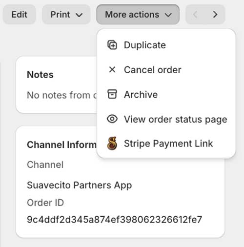
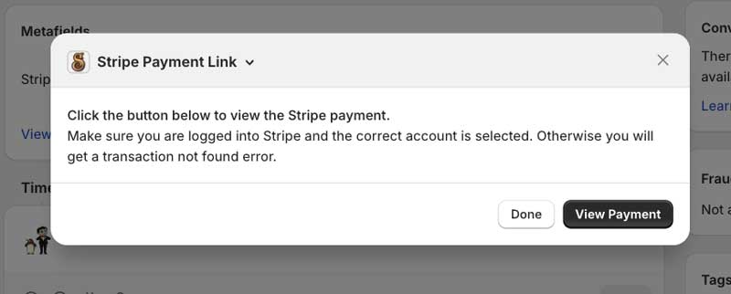

# Suavecito Partners App Extensions

> An extension only Shopify App

  

## Features

Stripe Payment Link

- Order Admin Extension
- Uses the metafield `suavecito.stripe_payment_intent` to generate a link to view the payment transaction in Stripe.

  

  

